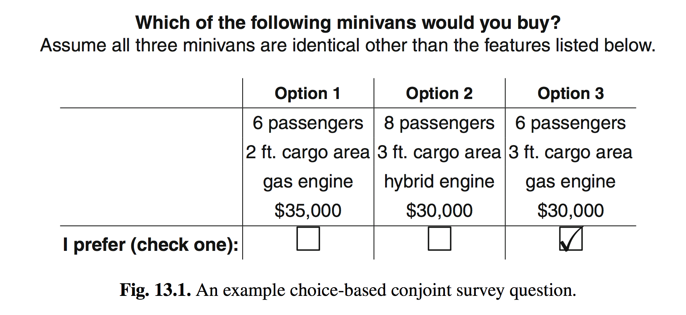
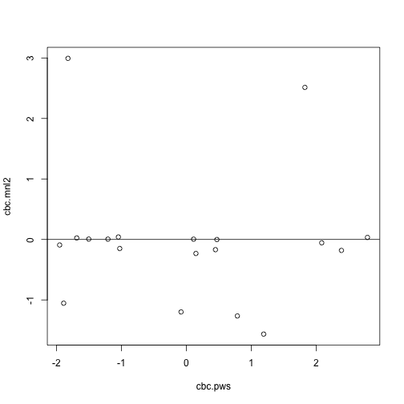
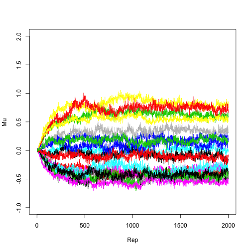
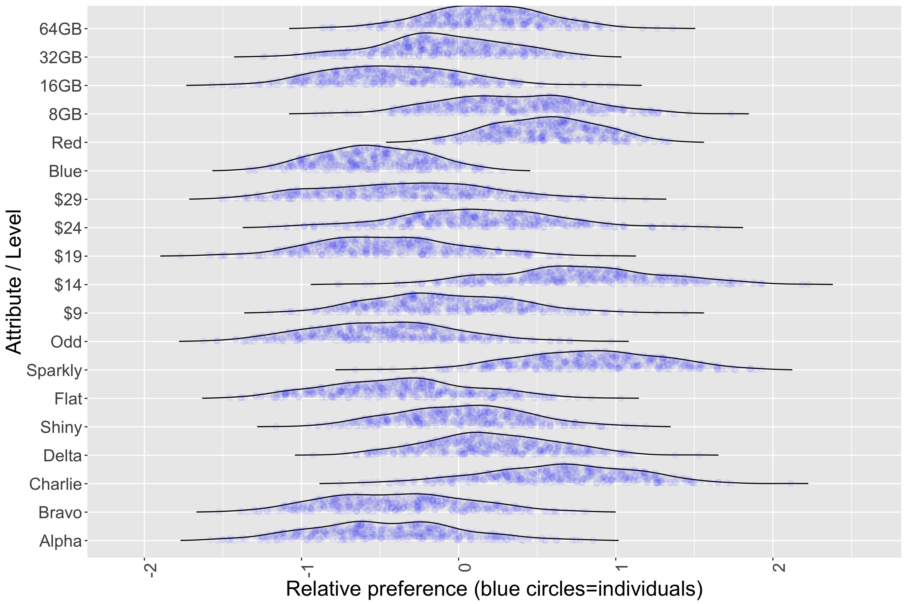

choicetools: a package for conjoint analysis and best-worst surveys
========================================================
author: Chris Chapman (ChromeOS) & Eric Bahna (Android Auto), Google
date: July 10, 2019
autosize: true
font-family: 'Arial'

<style>
.small-code pre code {
  font-size: 1em;
}
</style>


Choice-Based Conjoint Analysis
========================================================

A Choice-based conjoint (CBC) survey has respondents make tradeoffs among
products. A product has **attributes** such as brand,
performance, and price, and **levels**, such as
brand names or specific prices.




Hypothetical Product: USB Drive
========================================================
class: small-code

We imagine a USB flash drive with five attributes:


```r
cbc.attrs     <- c(Brand=4, Style=4, Price=5, Color=2, Size=4)
cbc.levels    <- c("Alpha", "Bravo", "Charlie", "Delta",    # Brand
                   "Shiny", "Flat",  "Sparkly", "Odd",      # Style
                   "$9",  "$14",  "$19",  "$24",  "$29",    # Price
                   "Blue",  "Red",                          # Color
                   "8GB", "16GB", "32GB", "64GB")           # Size
```

Each attribute has 2-5 levels (brand names, price points, etc.)

Given choices for multiple tradeoffs with randomized attributes, we model the contribution each
feature makes (multinomial/conditional logit model):

$$
p(choice | product) \propto preference(product)
$$

$$
preference(product) \propto \sum{preference(attributes)}
$$


Study Setup
=======================
class: small-code

Each respondent answers multiple choices (tasks). We set up the study to ask
12 choices with 3 products on each. The randomized design matrix
will have N=400 versions of the 12-task survey:


```r
set.seed(98103)

cbc.tasks     <- 12   # trials per respondent
cbc.concepts  <- 3    # cards per trial
N             <- 400  # N of respondents
```


Design Matrix
========================
class: small-code

Each level should appear
approximately the same number of times, alone and
in combination with every other attribute. This is done with
**`generalMNLrandomTab()`**:


```r
cbc.tab <- generateMNLrandomTab(cbc.attrs, respondents=N,
                                cards=cbc.concepts, trials=cbc.tasks )
#> Searching for a balanced design ...
#> Improved design found on trial:  8  SSE =  7.375579e-05 
#> Improved design found on trial:  17  SSE =  5.564236e-05 
#> Improved design found on trial:  35  SSE =  5.005787e-05 
#> Improved design found on trial:  37  SSE =  4.819637e-05 
#> Improved design found on trial:  47  SSE =  4.241898e-05
knitr::kable(head(cbc.tab, 3))  # first choice trial, 3 products
```


| Brand| Style| Price| Color| Size|
|-----:|-----:|-----:|-----:|----:|
|     2|     3|     2|     2|    2|
|     1|     2|     3|     1|    4|
|     3|     1|     5|     2|    1|

In most cases, you would obtain the design matrix from a survey authoring
platform.


Dummy Coded Design Matrix
==============================
class: small-code

We may convert the "tab style" layout to a dummy coded
matrix of 0 and 1:


| Brand-1| Brand-2| Brand-3| Brand-4| Style-1| Style-2| Style-3| Style-4| Price-1| Price-2| Price-3| Price-4| Price-5| Color-1| Color-2| Size-1| Size-2| Size-3| Size-4|
|-------:|-------:|-------:|-------:|-------:|-------:|-------:|-------:|-------:|-------:|-------:|-------:|-------:|-------:|-------:|------:|------:|------:|------:|
|       0|       1|       0|       0|       0|       0|       1|       0|       0|       1|       0|       0|       0|       0|       1|      0|      1|      0|      0|
|       1|       0|       0|       0|       0|       1|       0|       0|       0|       0|       1|       0|       0|       1|       0|      0|      0|      0|      1|
|       0|       0|       1|       0|       1|       0|       0|       0|       0|       0|       0|       0|       1|       0|       1|      1|      0|      0|      0|
|       0|       0|       0|       1|       0|       0|       1|       0|       1|       0|       0|       0|       0|       0|       1|      0|      1|      0|      0|
|       0|       1|       0|       0|       1|       0|       0|       0|       0|       1|       0|       0|       0|       1|       0|      0|      0|      0|      1|
|       1|       0|       0|       0|       0|       1|       0|       0|       0|       0|       0|       0|       1|       1|       0|      1|      0|      0|      0|

The first product concept (first row) is a combination of Brand 2,
Style 3, Price level 2, and so forth.


Survey Output as CSV
==============================
class: small-code

Given a design matrix, **`writeCBCdesignCSV()`** produces a
minimal "survey" in CSV format. This is easy to "field" in a classroom.

To ensure the data in the CSV match the design matrix, **`digest`** (Eddelbuettel et al, 2018)
adds a hash value for the design matrix.


```r
writeCBCdesignCSV(head(cbc.tab, 3), cards=3, trials=1,
                  attr.list=cbc.attrs, lab.attrs=names(cbc.attrs),
                  lab.levels = cbc.levels)
#> ##############################
#> CBC response file for design: 1d029ebfab00967d76d9a00dad28dc43
#> 
#> ##############################
#> Respondent 1 
#> 
#> TRIAL: 1
#> 	     1 	     2 	     3 	
#> Brand: 	 Bravo 	 Alpha 	 Charlie
#> Style: 	 Sparkly 	 Flat 	 Shiny
#> Price: 	 $14 	 $19 	 $29
#> Color: 	 Red 	 Blue 	 Red
#> Size: 	 16GB 	 64GB 	 8GB
#> 
#> CHOICE for Trial 1:
```


Creating Simulated Preference Data
========================================================
class: small-code

The simplest model is an aggregate multinomial logit model (MNL).
The coefficients are known as *part worths*. These sum to zero across levels
of each attribute.  **`generateRNDpws()`**  simulates part worths.

**`pickMNLwinningCards()`** uses part worths to find a preferred concept for
each task:

```r
cbc.pws <- generateRNDpws(cbc.attrs)    # make up some zero-sum part worths
cbc.win <- pickMNLwinningCards(cbc.des, cbc.pws)  # winning cards
#> Processing trial:  2000 
#> Processing trial:  4000
knitr::kable(head(cbind(cbc.win, cbc.des), 3))
```


| cbc.win| Brand-1| Brand-2| Brand-3| Brand-4| Style-1| Style-2| Style-3| Style-4| Price-1| Price-2| Price-3| Price-4| Price-5| Color-1| Color-2| Size-1| Size-2| Size-3| Size-4|
|-------:|-------:|-------:|-------:|-------:|-------:|-------:|-------:|-------:|-------:|-------:|-------:|-------:|-------:|-------:|-------:|------:|------:|------:|------:|
|       0|       0|       1|       0|       0|       0|       0|       1|       0|       0|       1|       0|       0|       0|       0|       1|      0|      1|      0|      0|
|       0|       1|       0|       0|       0|       0|       1|       0|       0|       0|       0|       1|       0|       0|       1|       0|      0|      0|      0|      1|
|       1|       0|       0|       1|       0|       1|       0|       0|       0|       0|       0|       0|       0|       1|       0|       1|      1|      0|      0|      0|

In the first set -- the first three rows -- the third concept
(Brand 3, Style 1, Price 5, etc.) was preferred and selected in the **`cbc.win`**
vector.


Aggregate Multinomial Logit Model
========================================================

The MNL model estimates preference for a product as
proportional to the sum of the *utility* values for its features. Preference
for A vs. B is the proportion of total utility represented by A:

$$
pref(A | \{A, B\}) = \frac{pref(A)}{pref(A)+pref(B)}
$$

Utility is the exponentiated sum of the features' part worth coefficients,
i.e., a product's logit value:

$$
\frac{pref(A)}{pref(A)+pref(B)} = \frac{e^{\sum{PW_A}}}{e^{\sum{PW_A}}+e^{\sum{PW_B}}}
$$

For conceptual simplicity, we leave out the intercepts and error terms.


Aggregate MNL Estimation
=================================
class: small-code

Now we estimate the part worths based on those "observed" choices:

```r
cbc.mnl <- estimateMNLfromDesign(cbc.des, cbc.win, cards=cbc.concepts)
```

We plot those against the original part worths and see near perfect recovery:

```r
plot(cbc.pws, cbc.mnl)
```


Write CSV Structure and Read Choices from It
========================================================
class: small-code

It is more interesting to collect real data! Most
of the time one would do that by fielding a survey online using survey authoring
tools such as **Sawtooth Software** or **Qualtrics**. These platforms
display CBC tasks in a suitable format for respondents.

For this vignette, we write out the CSV file, and then read the data:


```r
csv.filename <- "~/Downloads/testCBC.csv"
writeCBCdesignCSV(cbc.tab, filename=csv.filename,   # filename="" for console
                  cards=3, trials=12,
                  attr.list=cbc.attrs, lab.attrs=names(cbc.attrs),
                  lab.levels = cbc.levels, overwrite=TRUE)

# read the CSV
csvfile.in  <- readLines(csv.filename)
```


CSV with Random Choices
==========================
class: small-code

If respondents had filled in choices, we could estimate the MNL model from them.
Because they have not, we make some random choices and rewrite the CSV:

```r
# Fill in all of the choices with random choices (1, 2, or 3)
lines.with.choices <- which(grepl("CHOICE for Trial [0-9]+", csvfile.in))
csvfile.in[lines.with.choices] <- paste(csvfile.in[lines.with.choices],
                                        sample(cbc.concepts,
                                               length(lines.with.choices),
                                               replace = TRUE))
writeLines(csvfile.in, con=csv.filename)
```
Now we have a CSV that might have been completed by respondents (if they
were answering randomly). We read those data for the design matrix (`cbc.tab`)
using **`readCBCchoices()`**:

```r
# get those choices
cbc.choices <- readCBCchoices(cbc.tab, filename=csv.filename,
                              cards=3, trials=12, verbose=FALSE)
```


Estimation of Random Choice Data
===================================
class: small-code

**`estimateMNLfromDesign()`** estimates part worths from
data. It is primarily for didactic purposes, with an easy-to-understand
gradient implementation. Hierarchical Bayes estimation (*next slide*) is better
for production work.

We plot the part worths and see (for these random data) that estimates are
mostly near zero, with no correspondence to the original part worths:

```r
cbc.mnl2 <- estimateMNLfromDesign(cbc.des, cbc.choices, cards=cbc.concepts,
                                  no.output = TRUE)
plot(cbc.pws, cbc.mnl2)
abline(h=0)
```




Hierarchical Bayes Estimation
========================================================

Hierachical Bayes (HB) estimation is typically used for choice models to estimate
a mixed effects model. The *upper level* has fixed effects estimates
for the sample, while the *lower level* gives estimates for each
individual respondent within the distribution.

To estimate the hierarchical Bayes model, use the function
`estimateMNLfromDesignHB()`. This function is a wrapper that
simplifies the data setup and calls `ChoiceModelR::choicemodelr()`
(Sermas, 2012). It uses the *tab* format for the design matrix.

HB uses iterative MCMC estimation. For speed here,
we specify 2000 total MCMC draws (burn-in and posterior); in practice,
this would typically be 10000s, as MCMC needs a long
burn-in period for such data.

`estimateMNLfromDesignHB()` includes several common HB arguments:
- the proportion of the MCMC chain that is regarded as posterior
draws  (`pitersUsed`)
- whether to save the MCMC chain ("draws") for each respondent (`drawKeep`)
- the frequency of posterior draws to retain (every K'th draw in the
chain to avoid autocorrelation; `drawKeepK`)


HB Estimation
========================================================
class: small-code


```r
# replace 30% of the perfect "winning" vector with random draws
cbc.win2    <- cbc.win
cbc.replace <- sample(length(cbc.win2), length(cbc.win2)*0.3)  # to replace
cbc.win2[cbc.replace] <- sample(3, length(cbc.replace), replace=TRUE)

# estimate using the design and winning cards
cbc.hb <- estimateMNLfromDesignHB(tmp.des=cbc.tab, tmp.win=cbc.win2,
                                  kCards=cbc.concepts, kTrials=cbc.tasks,
                                  kResp=N , mcmcIters=2000)
#>                     Logit Data                    
#> ==================================================
#> Attribute       Type         Levels
#> -----------------------------------
#> Attribute 1    Part Worth      4
#> Attribute 2    Part Worth      4
#> Attribute 3    Part Worth      5
#> Attribute 4    Part Worth      2
#> Attribute 5    Part Worth      4
#> 
#> 14 parameters to be estimated.
#> 
#> 400 total units.
#> Average of 3 alternatives in each of 12 sets per unit.
#> 4800 tasks in total.
#> 
#> Table of choice data pooled across units:
#> Choice  Count   Pct.
#> --------------------
#>    1    972    20.25%
#>    2    1599   33.31%
#>    3    2229   46.44%
#> 
#>       MCMC Inference for Hierarchical Logit       
#> ==================================================
#> Total Iterations:          2000
#> Draws used in estimation:  1000
#> Units:                     400
#> Parameters per unit:       14
#> Constraints not in effect.
#> Draws are to be saved.
#> Prior degrees of freedom:  5
#> Prior variance:            2
#> 
#> MCMC Iteration Beginning...
```


```
#> Iteration  Acceptance   RLH     Pct. Cert.   Avg. Var.   RMS     
#> Time to End
#>       100  0.362        0.380   0.114        0.16        0.25    0:09  
#>       200  0.303        0.429   0.224        0.30        0.50    0:08  
#>       300  0.306        0.453   0.277        0.40        0.65    0:08  
#>       400  0.300        0.467   0.306        0.48        0.75    0:07
```



```
#>       500  0.306        0.472   0.317        0.52        0.80    0:07  
#>       600  0.306        0.475   0.323        0.57        0.84    0:06  
#>       700  0.304        0.478   0.329        0.59        0.86    0:06  
#>       800  0.308        0.481   0.334        0.61        0.87    0:05  
#>       900  0.303        0.479   0.331        0.61        0.87    0:05  
#>      1000  0.303        0.481   0.333        0.61        0.89    0:05  
#>      1100  0.302        0.480   0.332        0.59        0.88    0:04  
#>      1200  0.300        0.480   0.332        0.60        0.88    0:04  
#>      1300  0.299        0.478   0.328        0.61        0.87    0:03  
#>      1400  0.302        0.478   0.328        0.60        0.87    0:03  
#>      1500  0.304        0.480   0.332        0.61        0.88    0:02  
#>      1600  0.297        0.478   0.328        0.60        0.87    0:02  
#>      1700  0.299        0.476   0.323        0.58        0.85    0:01  
#>      1800  0.307        0.474   0.321        0.56        0.84    0:01  
#>      1900  0.308        0.477   0.327        0.56        0.84    0:00  
#>      2000  0.305        0.478   0.327        0.57        0.84    0:00  
#> 
#> Total Time Elapsed: 0:09
#> 
#> Writing estimated unit-level betas to Rbetas.csv in the working directory
```


Get Individual Estimates
========================================================
class: small-code

Estimates may be
extracted from the HB model with **`extractHBbetas()`** (and we add respondent
IDs):


```r
cbc.est        <- data.frame(extractHBbetas(cbc.hb, cbc.attrs))
names(cbc.est) <- cbc.levels
cbc.est$ID     <- 1:nrow(cbc.est)   # set respondent ID

# mean of MCMC chain per individual
head(cbc.est)
#>        Alpha       Bravo   Charlie       Delta      Shiny         Flat
#> 1 -0.4997400 -0.68652143 0.4198542  0.76640724 -0.5983791 -0.534706669
#> 2 -0.2927157 -0.38988933 0.5871751  0.09542995  0.3158654 -0.287247328
#> 3 -1.4966944  0.32503856 1.4698404 -0.29818457  0.1632377 -0.206093768
#> 4 -0.8882575 -0.04936736 0.8446392  0.09298558  1.0793851 -1.134929988
#> 5 -0.4101659 -1.01777366 0.9038024  0.52413712  0.1865601 -0.599280419
#> 6 -0.2664094 -0.66078766 0.3958085  0.53138856  0.1548074 -0.003601601
#>     Sparkly         Odd          $9        $14        $19        $24
#> 1 1.9313875 -0.79830174 -0.01871368  1.7422740 -1.1538048  0.4764291
#> 2 1.3424898 -1.37110790  0.39612222  1.4830933 -1.1347539 -0.1371388
#> 3 0.5353565 -0.49250051 -0.75974943  0.5904404  0.3789250 -0.9212234
#> 4 0.3079874 -0.25244245 -0.48370356  0.6257977 -0.5677943  0.6909679
#> 5 0.5088712 -0.09615084 -0.29313176 -0.7557123 -0.2117941  1.2288428
#> 6 0.1970143 -0.34822007 -0.40228457  0.7168540 -0.9230615  0.5014125
#>           $29       Blue       Red        8GB       16GB        32GB
#> 1 -1.04618465 -0.4316321 0.4316321  0.5124843 -0.3821001 -0.42334567
#> 2 -0.60732272 -0.9769510 0.9769510  0.9684142 -0.3010086 -0.85703427
#> 3  0.71160741 -0.6302464 0.6302464  0.6959751 -0.3620261 -0.04441025
#> 4 -0.26526781 -0.3799779 0.3799779  0.3444515 -0.6725858 -0.20206752
#> 5  0.03179532 -0.1376253 0.1376253 -0.2521733 -0.1732746 -0.04664018
#> 6  0.10707963 -0.6193282 0.6193282  0.6857107 -0.4190226 -0.94944218
#>         64GB ID
#> 1  0.2929615  1
#> 2  0.1896287  2
#> 3 -0.2895388  3
#> 4  0.5302019  4
#> 5  0.4720881  5
#> 6  0.6827541  6
```


Plot Individual HB Estimates
===============================
class: small-code

It is helpful to plot individuals' estimates, as this is informative about
the variation in preferences for features. **`ggridges`** works well (next slide):

```r
library(ggplot2)
library(reshape2)
cbc.m <- melt(cbc.est, id.vars = "ID")

library(ggridges)
ggplot(data=cbc.m, aes(x=value, y=variable, group=variable)) +
      geom_density_ridges(scale=0.9, alpha=0, jittered_points=TRUE,
                          rel_min_height=0.005,
                          position="points_sina",
                          point_color = "blue", point_alpha=1/sqrt(N),
                          point_size=2.5) +
        ylab("Attribute / Level") +
        xlab("Relative preference (blue circles=individuals)")
```

Because we are using simulated data, these will be Guassian. In real data,
you might see other patterns such as bimodal distributions.


Individual estimates
==============================



Preference Share (Market Simulation)
=========================================
class: small-code

Share of preference (aka "market share") may be estimated using
the **`marketSim()`** function. Compare:
- Flat 8GB Blue drive at \$9 from Alpha **vs.**
- Odd 64GB Red drive at \$24 from Bravo

We specify the sets of attributes for each product and compare
them. In this case, we will use first choice preference, where
each individual is regarded as "purchasing" the item with highest preference;
other options in **`marketSim()`** include share of preference at the individual
level, and first choice with randomization:


```r
prod1 <- c(6, 16, 14,  9, 1)  # attribute cols: Flat 8GB Blue $9 Alpha
prod2 <- c(8, 19, 15, 12, 2)  # attribute cols: Odd 64GB Red $24 Bravo
usb.pref  <- marketSim(
  cbc.est,                    # matrix of individual-level utilities
  list(prod1, prod2),         # list of products to compare
  use.none=FALSE,             # we have no "none" column
  style="first")              # estimate share by first-choice approach

# see the overall preference share for the two products
colMeans(usb.pref)
#> [1] 0.2275 0.7725
```
Between just these two products, we estimate that
23% of respondents prefer product 1,
the $9 flat 8GB drive from Alpha.


Classroom Usage
=========================================
To use this package in a classroom setting:

- Cover the concepts of choice-based conjoint analysis
- Show product attributes and tasks are randomly created
- Write out a CSV file
- Share the CSV and have each student complete a block in the shared document
- Download the spreadsheet CSV, read the answers, and estimate the results
- Share the results and discuss them

In classroom settings, the individual level plots often lead
to interesting discussion and demonstration that the method "works".


Features Beyond CBC
=========================================

The **`choicetools`** package includes support for many other features of CBC
models and related marketing analyses that are beyond the scope of this
vignette. Those include:

- MaxDiff / Best-Worst Scaling, with support to import models from Sawtooth
Software and Qualtrics. Unlike the largely didactic support for CBC models,
the MaxDiff features are intended to be production quality. Cf. Bahna & Chapman (2018).
- Composite Perceptual Maps for brand positioning.
- Experimental CBC models to assess attribute importance. With inspiration
from random forest variable importance methods, this method omits an attribute
and examines the change in predictive validity under oblation to determine the
importance of that attribute.


=========================================

# Thank you! + Q&A + References

**Package in development**: https://github.com/cnchapman/choicetools

Bahna, E., and Chapman, CN (2018). Constructed, Augmented MaxDiff. In
B. Orme, ed., *Proc 2018 Sawtooth Software Conference*.

Chapman, CN, and Feit, EMF (2019). *R for Marketing Research and Analytics*,
2nd ed. Chapter 13: Choice Modeling. New York: Springer.

Eddelbuettel, D; with A Lucas, J Tuszynski,
H Bengtsson, S Urbanek, M Frasca, B Lewis, M Stokely,
H Muehleisen, D Murdoch, J Hester, W Wu, Q Kou,
T Onkelinx, Ml Lang, V Simko, K Hornik and R Neal.
(2018). **digest**: Create Compact Hash Digests of R Objects. R package
version 0.6.18. https://CRAN.R-project.org/package=digest

Rossi, PE, Allenby, GM, and McCulloch, RE (2005).
*Bayesian Statistics and Marketing*. New York: Wiley.

Sermas, Ryan (2012). **ChoiceModelR**: Choice Modeling in R. R package version 1.2.
https://CRAN.R-project.org/package=ChoiceModelR

Wickham, H. (2016). *ggplot2: Elegant Graphics for Data Analysis*. New York: Springer.

Wilke, CO. (2018). **ggridges**: Ridgeline Plots in 'ggplot2'. R package version 0.5.1.
https://CRAN.R-project.org/package=ggridges
